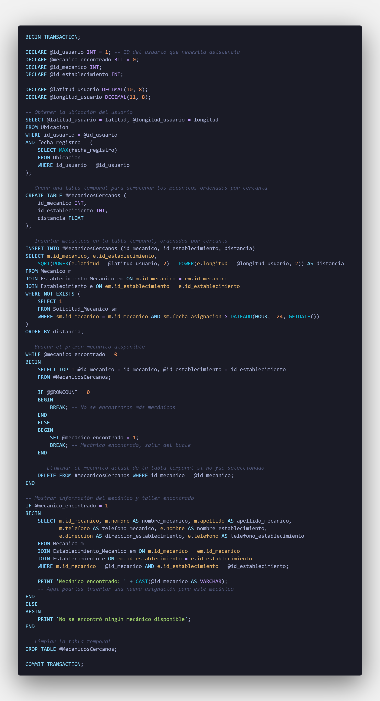

<h1>Break</h1> 

Necesitamos encontrar el primer mecánico disponible que no tenga asignaciones pendientes y esté en un taller cercano a la ubicación del usuario. Una vez encontrado, mostraremos su información y la del taller asociado
 

<h3>Codigo</h3>

<h3>Resultado</h3>

